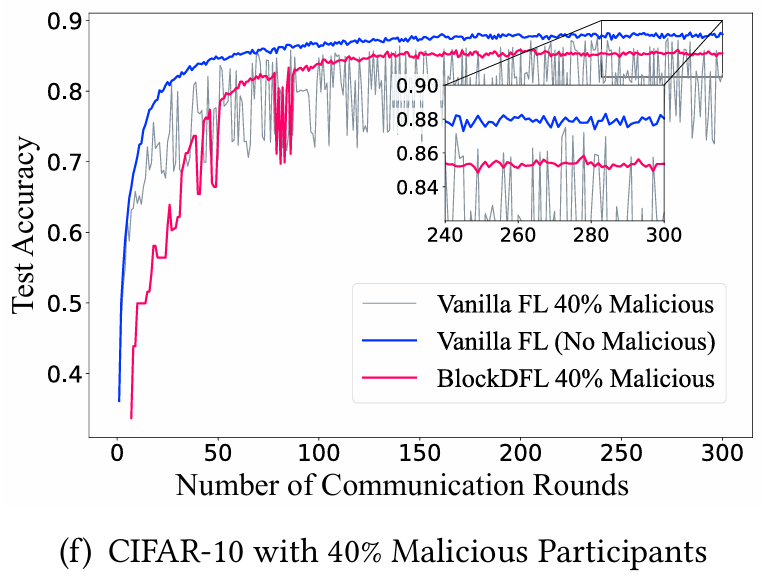

# Blockchain-based-Federated-Learning-against-Latent-Attack-Benchmark

我現在要快速做一個潛伏攻擊的benchmark mvp
目的:
證明BlockDFL的方法在學習後期會沒辦法收斂(因為委員會被潛伏了，固定選擇4個update中最差的aggregated update)，而我的方法可以收斂
我不需要做區塊鏈部分，我也不一定需要federated learning(不過我不清楚真的使用了FL框架會不會比較快能製作攻擊情景，如果使用FL框架比較方便的話也可以用flower框架)，我只要讓學習(MNIST和CIFAR-10)的時候，每一步會切出4個updates，模擬的BlockDFL會在100輪後選擇最差的，而我的會選擇最好的
學習持續300輪，最後畫的圖要類似這種

x軸為 Number of Communication Rounds
y軸為 Test Accuracy
數據有BlockDFL和CACA兩個